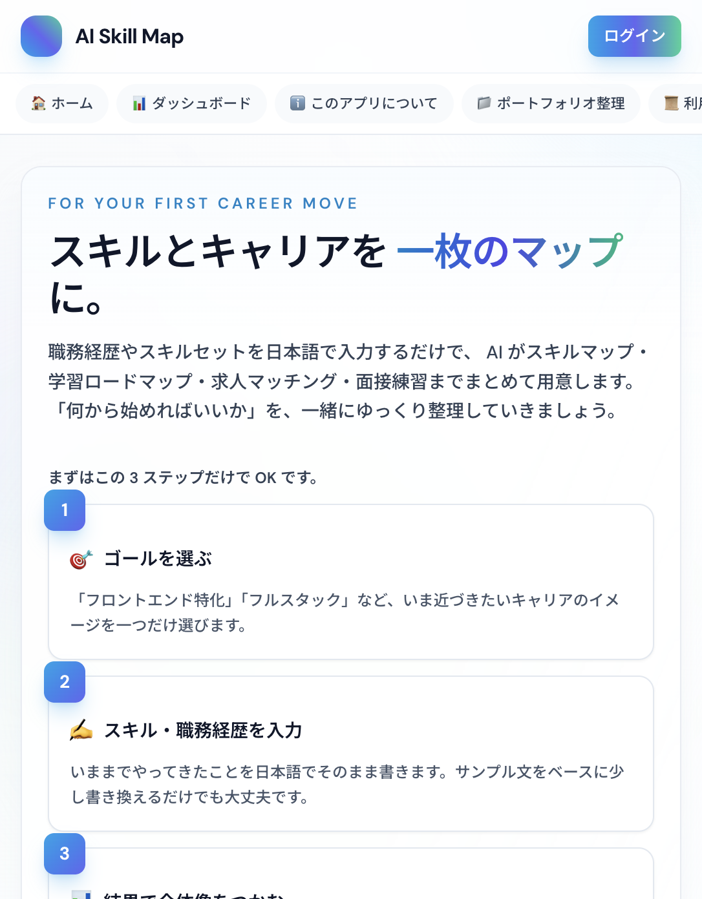
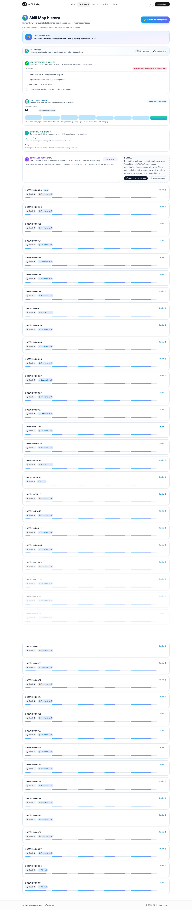
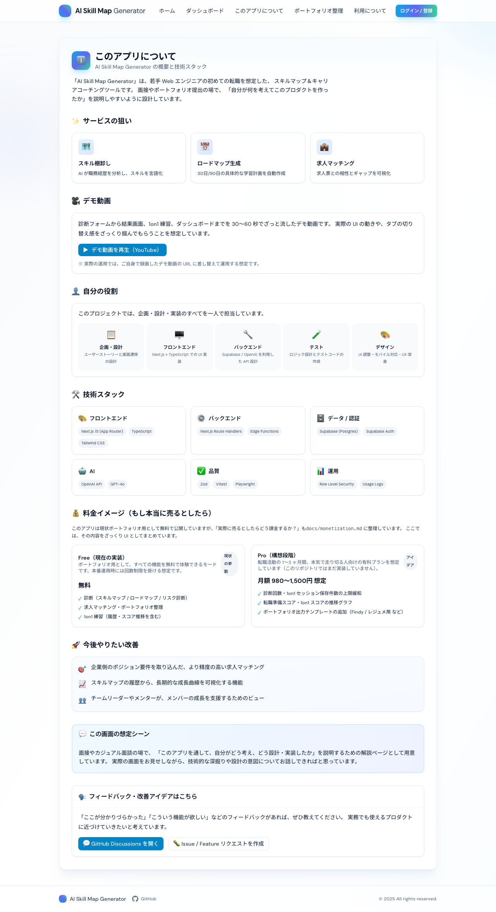

<h1 align="center">
  
  <br />
  AI Skill Map Generator
</h1>

<p align="center">
  <strong>🎯 A career diagnosis SaaS for web engineers — built solo to prove I can ship production-grade products</strong>
</p>

<p align="center">
  <a href="https://ai-skill-map-generator.vercel.app">
    
  </a>
</p>

<p align="center">
  <a href="https://github.com/AyumuKobayashiproducts/ai-skill-map-generator/actions/workflows/ci.yml">
    
  </a>
  
  
  
  
  
  
  
</p>

<p align="center">
  <a href="./README.ja.md">🇯🇵 日本語版 README</a>
  &nbsp;·&nbsp;
  <a href="#-live-demo">Live Demo</a>
  &nbsp;·&nbsp;
  <a href="#-features">Features</a>
  &nbsp;·&nbsp;
  <a href="#-engineering-highlights">Engineering</a>
  &nbsp;·&nbsp;
  <a href="#-quick-start">Quick Start</a>
</p>

---

## 📊 Metrics at a Glance

<table>
  <tr>
    <td align="center"><strong>14,000+</strong><br/><small>Lines of TypeScript</small></td>
    <td align="center"><strong>16</strong><br/><small>API Endpoints</small></td>
    <td align="center"><strong>30</strong><br/><small>React Components</small></td>
    <td align="center"><strong>960</strong><br/><small>i18n Keys (EN + JP)</small></td>
    <td align="center"><strong>5</strong><br/><small>E2E Test Suites</small></td>
    <td align="center"><strong>79</strong><br/><small>Git Commits</small></td>
  </tr>
</table>

---

<p align="center">
  
</p>

---

## 🧠 Why This Project Exists

> **The problem**: Most portfolio projects stop at "I built a thing." They don't show product thinking, production concerns, or the ability to ship end-to-end.

I built this project to **simulate what it's like to be a solo founder or the first engineer at a startup**:

- **Discovery**: Interviewed 3 junior engineers to understand their pain points during job hunting
- **UX Design**: Wireframed flows, designed a 60-second "time to value" goal, iterated based on friction
- **AI Integration**: Not just "call GPT" — designed structured prompts, validated outputs with Zod, handled edge cases
- **Data Modeling**: PostgreSQL schema with RLS, thought about what scales and what doesn't
- **Observability**: Usage logging, error tracking integration points, cost monitoring awareness
- **Internationalization**: Full EN/JP support from day one, not bolted on later

**This is not a tutorial clone. It's a vertical slice of SaaS engineering.**

---

## 💡 What This Project Says About Me

| Signal | Evidence |
|--------|----------|
| **Product Thinking** | Designed a 5-step career diagnosis flow with clear user outcomes, not just features |
| **Full-Stack Ownership** | Next.js 14 + TypeScript + Supabase + OpenAI — architected, built, and deployed solo |
| **AI Engineering** | 16 API endpoints with prompt engineering, Zod validation, streaming, and graceful degradation |
| **Quality Culture** | Vitest unit tests, Playwright E2E, GitHub Actions CI — testing what matters, not chasing coverage % |
| **Internationalization** | 960 i18n keys, locale-aware routing, API error messages in both languages |
| **UX Polish** | Loading states, error boundaries, skip links, keyboard navigation, mobile-first responsive |

---

## 🎬 Live Demo

**👉 [ai-skill-map-generator.vercel.app](https://ai-skill-map-generator.vercel.app)**

### What to try:

1. **🏠 Home**: Click "Insert sample text" → Generate → See how 60-second promise is delivered
2. **📊 Dashboard**: View history, track how scores evolve over multiple diagnoses
3. **🎤 1-on-1 Practice**: Pick an interview type → Answer questions → Get AI feedback with rule-based scoring
4. **💼 Job Match**: Paste a job description → See skill gap analysis with match percentage
5. **🌐 Language Toggle**: Switch between EN/JP in the header — everything changes, nothing breaks

---

## ✨ Features

<table>
  <tr>
    <td align="center" width="33%">
      
      <br /><strong>🎯 3-Step Diagnosis</strong>
      <br /><small>Paste your experience → AI analyzes → Get actionable roadmap</small>
    </td>
    <td align="center" width="33%">
      
      <br /><strong>📊 Progress Dashboard</strong>
      <br /><small>Track your growth over time with visual history</small>
    </td>
    <td align="center" width="33%">
      
      <br /><strong>ℹ️ Transparent Design</strong>
      <br /><small>Show users how the system works (builds trust)</small>
    </td>
  </tr>
</table>

### Core Capabilities

| Feature | What It Does | Engineering Highlight |
|---------|--------------|----------------------|
| 🗺️ **Skill Map** | Radar chart of 5 skill categories | Zod-validated JSON from GPT, Chart.js rendering |
| 📈 **Learning Roadmap** | 30-day and 90-day personalized plans | Structured prompt with user goal context |
| 💼 **Job Matching** | Compare skills against job descriptions | Text similarity + gap analysis in one prompt |
| ⚠️ **Career Risk** | Quantify obsolescence/automation risk | Multi-factor scoring with weighted averages |
| 🎤 **1-on-1 Practice** | Mock interviews with feedback | Hybrid scoring: rule-based + AI feedback |
| 📋 **Portfolio Gen** | Markdown export of projects | Template-based generation with i18n |
| ⏰ **Time Simulator** | Adjust roadmap to available hours | Client-side recalculation, no extra API call |

---

## 🔬 Engineering Highlights

### 1. Hybrid Interview Scoring

The 1-on-1 practice feature doesn't just ask GPT for a score. That would be inconsistent and unexplainable.

```typescript
// lib/answerEvaluator.ts - Rule-based scoring that feeds into AI prompt
const weights = {
  general:   { length: 0.25, specificity: 0.30, structure: 0.25, star: 0.20 },
  technical: { length: 0.20, specificity: 0.35, structure: 0.25, star: 0.20 },
  behavioral:{ length: 0.15, specificity: 0.25, structure: 0.20, star: 0.40 },
};
```

**Why?** Rule-based scores are consistent and debuggable. AI provides nuanced, contextual feedback. Together they create a better experience than either alone.

### 2. Type-Safe API Contracts

Every API endpoint has a Zod schema for both request and response:

```typescript
// types/api.ts
export const GenerateRequestSchema = z.object({
  goal: z.string().min(1),
  experience: z.string().min(50),
  locale: z.enum(["en", "ja"]).optional(),
});

export const GenerateResponseSchema = z.object({
  id: z.string().uuid(),
  categories: SkillCategoriesSchema,
  roadmap30: z.string(),
  roadmap90: z.string(),
  // ...
});
```

**Why?** Catch malformed AI responses at the boundary, not deep in the UI where debugging is painful.

### 3. Locale-Aware Error Handling

API errors return localized messages:

```typescript
// lib/apiErrors.ts
const API_ERRORS = {
  GENERATE_FAILED: {
    en: "Skill map generation failed. Please try again.",
    ja: "スキルマップの生成に失敗しました。もう一度お試しください。",
  },
  // ... 20+ error codes
};
```

**Why?** Users shouldn't see English error messages in a Japanese UI. It breaks trust.

### 4. Progressive Enhancement in AI Features

```typescript
// Graceful degradation when interview session table doesn't exist
const { data, error } = await query;
if (error) {
  console.warn("interview_sessions unavailable:", error);
  return NextResponse.json({ sessions: [] }); // Don't break the UI
}
```

**Why?** Portfolio demos shouldn't crash because optional features aren't configured.

---

## 🛠 Tech Stack

```
┌─────────────────────────────────────────────────────────────────────┐
│  FRONTEND                                                           │
│  ├─ Next.js 14 (App Router, RSC, Server Actions ready)              │
│  ├─ React 18 (Suspense, Transitions)                                │
│  ├─ TypeScript 5.6 (strict: true, no implicit any)                  │
│  ├─ Tailwind CSS (custom design system: 8px scale, gray/blue)       │
│  ├─ Chart.js + react-chartjs-2 (radar charts)                       │
│  └─ next-intl (1000 lines of translation config)                    │
├─────────────────────────────────────────────────────────────────────┤
│  BACKEND (Next.js API Routes)                                       │
│  ├─ 16 Route Handlers (generate, job-match, risk, oneonone/*, etc.) │
│  ├─ OpenAI SDK (GPT-4o-mini, structured outputs)                    │
│  ├─ Zod (request validation + response parsing)                     │
│  └─ Custom error codes with i18n messages                           │
├─────────────────────────────────────────────────────────────────────┤
│  DATABASE & AUTH                                                    │
│  ├─ Supabase (PostgreSQL with RLS)                                  │
│  ├─ Supabase Auth (Email + Google OAuth)                            │
│  ├─ 4 tables: profiles, skill_maps, interview_sessions, usage_logs  │
│  └─ Service role client for server-side operations                  │
├─────────────────────────────────────────────────────────────────────┤
│  QUALITY & DEVOPS                                                   │
│  ├─ Vitest (unit tests for scoring logic)                           │
│  ├─ Playwright (E2E for critical paths + screenshot automation)     │
│  ├─ ESLint + Prettier (consistent code style)                       │
│  ├─ GitHub Actions (CI on every push)                               │
│  └─ Vercel (preview deploys + production)                           │
└─────────────────────────────────────────────────────────────────────┘
```

---

## 🏛 Architecture

```
┌─────────────────────────────────────────────────────────────────────────┐
│                         USER JOURNEY                                     │
│  ┌──────────┐    ┌──────────┐    ┌──────────┐    ┌──────────┐          │
│  │  Input   │ →  │ Diagnose │ →  │  Result  │ →  │  Action  │          │
│  │  Skills  │    │   (AI)   │    │  (Tabs)  │    │ Practice │          │
│  └──────────┘    └──────────┘    └──────────┘    └──────────┘          │
└─────────────────────────────────────────────────────────────────────────┘
                                    │
                    ┌───────────────┼───────────────┐
                    ▼               ▼               ▼
┌─────────────────────────────────────────────────────────────────────────┐
│                          API LAYER                                       │
│  ┌─────────────┐ ┌─────────────┐ ┌─────────────┐ ┌─────────────┐       │
│  │ /generate   │ │ /job-match  │ │ /oneonone/* │ │ /risk       │       │
│  │ Skill map   │ │ Gap analysis│ │ 4 endpoints │ │ Risk score  │       │
│  └──────┬──────┘ └──────┬──────┘ └──────┬──────┘ └──────┬──────┘       │
│         │               │               │               │               │
│         └───────────────┴───────┬───────┴───────────────┘               │
│                                 │                                        │
│                    ┌────────────┴────────────┐                          │
│                    ▼                         ▼                          │
│             ┌──────────────┐         ┌──────────────┐                   │
│             │   OpenAI     │         │   Supabase   │                   │
│             │  GPT-4o-mini │         │  PostgreSQL  │                   │
│             │  (prompts)   │         │  (RLS + Auth)│                   │
│             └──────────────┘         └──────────────┘                   │
└─────────────────────────────────────────────────────────────────────────┘
```

---

## 📐 Design Decisions & Trade-offs

| Decision | Why | Trade-off |
|----------|-----|-----------|
| **GPT-4o-mini over GPT-4** | Cost: ~$0.01/diagnosis vs ~$0.10. Portfolio demos need to be cheap. | Slightly less nuanced analysis |
| **Zod over tRPC** | Simpler mental model for a solo project. tRPC adds complexity for marginal gain here. | No end-to-end type inference |
| **Supabase over Prisma+PlanetScale** | Auth + DB + RLS in one. Less config, faster iteration. | Vendor lock-in for auth |
| **Rule-based + AI scoring** | Consistent scores + nuanced feedback. Pure AI scores vary wildly. | More code to maintain |
| **Full i18n from day 1** | Shows attention to global users. Good portfolio signal. | 2x translation effort |
| **No state management lib** | React Server Components + URL state is enough for this scale. | Would need Redux/Zustand if scaling |

---

## 🎯 Hiring Manager? Here's What to Look At

### Quick Wins (5 min)

1. **[Live Demo](https://ai-skill-map-generator.vercel.app)**: Do the 60-second flow. Does it feel polished?
2. **[`types/api.ts`](./types/api.ts)**: See how API contracts are defined with Zod
3. **[`lib/answerEvaluator.ts`](./lib/answerEvaluator.ts)**: The rule-based scoring logic

### Deep Dives (15 min)

| Area | Files to Read | What You'll See |
|------|---------------|-----------------|
| **AI Integration** | `app/api/generate/route.ts`, `lib/safeChatCompletion.ts` | Prompt engineering, error handling, retry logic |
| **Component Design** | `components/SkillResultView.tsx`, `components/ui/` | How I structure complex UIs |
| **i18n Architecture** | `src/messages/*.json`, `src/i18n/`, `components/LanguageSwitcher.tsx` | 960 keys, locale routing |
| **Testing Philosophy** | `tests/e2e/`, `docs/testing.md` | What I test and why |

### Interview Topics I'd Love to Discuss

1. **"Walk me through the 1-on-1 practice feature architecture"**
   - How rule-based + AI hybrid scoring works
   - Why I chose to separate questions/feedback/summary into different endpoints
   - How session history enables "growth visualization"

2. **"How did you handle AI output validation?"**
   - Zod schemas for structured outputs
   - Graceful degradation when AI returns unexpected formats
   - The balance between strict typing and flexibility

3. **"What would you do differently at scale?"**
   - Move prompts to a CMS for A/B testing
   - Add streaming for long-running generations
   - Implement proper rate limiting and cost controls

---

## 📚 Documentation

| Document | What You'll Find |
|----------|------------------|
| **[docs/architecture.md](docs/architecture.md)** | Mermaid diagrams, data flow, component structure |
| **[docs/testing.md](docs/testing.md)** | Testing strategy, why I test what I test |
| **[docs/i18n.md](docs/i18n.md)** | Internationalization implementation details |
| **[docs/case-studies.md](docs/case-studies.md)** | User personas and "before/after" narratives |
| **[docs/performance.md](docs/performance.md)** | Perceived latency tricks, bundle optimization |
| **[docs/accessibility.md](docs/accessibility.md)** | Skip links, keyboard nav, ARIA considerations |

---

## 🚀 Quick Start

```bash
# Clone
git clone https://github.com/AyumuKobayashiproducts/ai-skill-map-generator.git
cd ai-skill-map-generator

# Install
npm install

# Configure (copy and fill in your keys)
cp .env.example .env.local

# Required in .env.local:
#   OPENAI_API_KEY=sk-...
#   NEXT_PUBLIC_SUPABASE_URL=https://xxx.supabase.co
#   NEXT_PUBLIC_SUPABASE_ANON_KEY=eyJ...

# Run
npm run dev
```

### Scripts

```bash
npm run dev          # Development server
npm run build        # Production build
npm run lint         # ESLint
npm run type-check   # TypeScript strict check
npm run test         # Vitest unit tests
npm run test:e2e     # Playwright E2E tests
npm run screenshot   # Capture docs screenshots
```

---

## 📁 Project Structure

```
ai-skill-map-generator/
├── app/                     # Next.js App Router
│   ├── [locale]/           # Locale-based routing (en, ja)
│   ├── api/                # 16 API route handlers
│   │   ├── generate/       # Main skill map generation
│   │   ├── job-match/      # Job description matching
│   │   ├── oneonone/       # Interview practice (4 endpoints)
│   │   ├── risk/           # Career risk analysis
│   │   └── ...
│   ├── dashboard/          # History & progress tracking
│   └── result/[id]/        # Tabbed result view
├── components/             # 30 React components
│   ├── ui/                 # Design system (Button, Card, etc.)
│   ├── SkillResultView.tsx # Main result orchestrator
│   ├── OneOnOnePractice*   # Interview practice UI
│   └── ...
├── lib/                    # Business logic
│   ├── answerEvaluator.ts  # Rule-based scoring
│   ├── apiClient.ts        # Type-safe fetch wrapper
│   ├── apiErrors.ts        # i18n error codes
│   └── ...
├── types/                  # TypeScript types + Zod schemas
├── src/messages/           # i18n translations (en.json, ja.json)
├── tests/                  # Vitest + Playwright
└── docs/                   # Extended documentation
```

---

## 📈 What I Learned Building This

1. **AI outputs need guardrails**: GPT doesn't always return valid JSON. Zod validation at the boundary saved hours of debugging.

2. **i18n is easier early, painful later**: Adding translations to 30 components after the fact would have been brutal. Doing it from day 1 was the right call.

3. **Hybrid scoring beats pure AI scoring**: Users trust scores more when they can understand the criteria. Rule-based gives consistency; AI gives nuance.

4. **Error states are UX**: 70% of UX polish is handling loading, empty, and error states well. The happy path is easy.

5. **Portfolio projects need boundaries**: I could have added 20 more features. Shipping a polished subset beats a buggy everything.

---

## 🤝 Contributing

This is a portfolio project, but contributions are welcome! See [CONTRIBUTING.md](./CONTRIBUTING.md).

---

## 📜 License

MIT — see [LICENSE](./LICENSE).

---

<p align="center">
  <strong>Thanks for reading this far! 🙏</strong>
  <br /><br />
  Built as a portfolio project to demonstrate full-stack product engineering.
  <br />
  <a href="https://github.com/AyumuKobayashiproducts">@AyumuKobayashiproducts</a>
  <br /><br />
  ⭐ Stars are appreciated and help with visibility!
</p>
